# CI/CD Pipeline Documentation

## 🚀 Overview

This project uses **GitHub Actions** for Continuous Integration and Continuous Deployment (CI/CD). The pipeline automatically runs tests, security checks, and builds on every push and pull request.

---

## 📋 Pipeline Structure

### **Current Status**: ✅ CI Pipeline Active | ❌ Deployment Disabled (Testing Phase)

The CI/CD pipeline consists of two main workflows:

1. **CI Pipeline** (`.github/workflows/ci.yml`) - **ACTIVE**
2. **Deploy Pipeline** (`.github/workflows/deploy.yml`) - **DISABLED**

---

## 🔄 CI Pipeline Jobs

The CI pipeline runs automatically on:

- Push to `main` or `develop` branches
- Pull requests to `main` or `develop` branches

### **Job 1: Lint & Format Check**

**Duration**: ~30 seconds  
**Purpose**: Ensure code quality and consistent formatting

```bash
npm run lint
npm run format
```

**Checks**:

- ESLint rules compliance
- Prettier formatting consistency
- TypeScript best practices

---

### **Job 2: TypeScript Type Check**

**Duration**: ~45 seconds  
**Purpose**: Verify type safety across the codebase

```bash
npm run build
```

**Checks**:

- No TypeScript compilation errors
- Type definitions are correct
- Import/export statements are valid

---

### **Job 3: Unit Tests**

**Duration**: ~1 minute  
**Purpose**: Run all unit tests

```bash
npm run test
```

**Features**:

- Runs all `.spec.ts` files
- Generates coverage reports
- Uploads coverage artifacts (retained for 7 days)

---

### **Job 4: E2E Tests** 🔥 **Most Critical**

**Duration**: ~2-3 minutes  
**Purpose**: Integration testing with real database

**Environment**:

- PostgreSQL 14 (Docker container)
- Test database: `histo_rando_test`
- All 134 E2E tests must pass

```bash
npm run test:e2e
```

**Database Setup**:

```yaml
services:
  postgres:
    image: postgres:14-alpine
    env:
      POSTGRES_USER: testuser
      POSTGRES_PASSWORD: testpassword
      POSTGRES_DB: histo_rando_test
    ports:
      - 5432:5432
```

**Environment Variables**:

- `NODE_ENV=test`
- `DB_HOST=localhost`
- `DB_PORT=5432`
- `DB_USERNAME=testuser`
- `DB_PASSWORD=testpassword`
- `DB_NAME=histo_rando_test`
- `JWT_SECRET=test-jwt-secret-key-for-ci-pipeline-testing-only`
- `JWT_EXPIRES_IN=7d`

---

### **Job 5: Security Audit**

**Duration**: ~30 seconds  
**Purpose**: Check for known vulnerabilities

```bash
npm audit --audit-level=moderate
```

**Features**:

- Scans all dependencies
- Generates JSON audit report
- Uploads report artifacts (retained for 30 days)
- Continues on error (won't fail the build)

---

### **Job 6: Production Build Check**

**Duration**: ~1 minute  
**Purpose**: Ensure production build succeeds

```bash
NODE_ENV=production npm run build
```

**Checks**:

- Build completes without errors
- `dist/` directory is created
- All TypeScript compiles correctly
- Uploads build artifacts (retained for 7 days)

---

### **Job 7: Pipeline Status Summary**

**Duration**: ~5 seconds  
**Purpose**: Final status report

**Output Example**:

```
============================================
🎯 CI Pipeline Status Summary
============================================
Lint & Format: success
Type Check: success
Unit Tests: success
E2E Tests: success
Security Audit: success
Build Check: success
============================================
✅ All checks PASSED - Ready for deployment!
💡 To deploy, uncomment the deploy-to-heroku job
```

---

## 🎯 Workflow Visualization

```mermaid
graph TD
    A[Push/PR to main/develop] --> B[Lint & Format]
    B --> C[Type Check]
    B --> D[Unit Tests]
    B --> E[Security Audit]
    C --> F[E2E Tests]
    D --> F
    E --> G[Build Check]
    F --> G
    G --> H[Pipeline Status]
    H --> I{All Passed?}
    I -->|Yes| J[✅ Ready for Deploy]
    I -->|No| K[❌ Fix Issues]
```



---

## 📊 Pipeline Artifacts

Each pipeline run generates artifacts that can be downloaded:

| Artifact              | Retention | Job            | Purpose                    |
| --------------------- | --------- | -------------- | -------------------------- |
| Unit Test Coverage    | 7 days    | Unit Tests     | Code coverage reports      |
| E2E Test Results      | 7 days    | E2E Tests      | Integration test output    |
| Security Audit Report | 30 days   | Security Audit | Vulnerability scan results |
| Production Build      | 7 days    | Build Check    | Compiled application       |

**Access Artifacts**:

1. Go to GitHub repository → Actions tab
2. Click on a workflow run
3. Scroll to bottom → "Artifacts" section
4. Download desired artifact

---

## 🔒 Security Features

### **1. Secrets Management**

All sensitive data is stored in GitHub Secrets (not in code):

```yaml
# Required secrets (when deployment is enabled):
HEROKU_API_KEY      # Heroku API authentication key
HEROKU_APP_NAME     # Your Heroku app name
HEROKU_EMAIL        # Email associated with Heroku account
```

### **2. Dependency Scanning**

- Runs `npm audit` on every build
- Checks for moderate+ severity vulnerabilities
- Generates detailed audit reports

### **3. Branch Protection**

Recommended settings for `main` branch:

- ✅ Require pull request reviews
- ✅ Require status checks to pass (all CI jobs)
- ✅ Require branches to be up to date
- ✅ Include administrators

---

## ⚙️ Local Testing (Simulate CI)

Run the same checks locally before pushing:

```bash
# 1. Lint & Format
npm run lint
npm run format

# 2. Type Check
npm run build

# 3. Unit Tests
npm run test

# 4. E2E Tests (requires PostgreSQL)
npm run test:e2e

# 5. Security Audit
npm audit --audit-level=moderate

# 6. Production Build
NODE_ENV=production npm run build
```

---

## 🚨 Troubleshooting Common CI Failures

### **❌ Lint Failures**

```bash
Error: ESLint found issues
```

**Fix**:

```bash
npm run lint  # Auto-fix issues
```

---

### **❌ Format Failures**

```bash
Error: Prettier check failed
```

**Fix**:

```bash
npm run format  # Auto-format files
git add .
git commit -m "fix: format code"
```

---

### **❌ Type Check Failures**

```bash
Error: TS2339: Property 'x' does not exist
```

**Fix**:

1. Check TypeScript errors in VS Code
2. Fix type issues
3. Run `npm run build` locally to verify

---

### **❌ E2E Test Failures**

```bash
Error: Database connection refused
```

**Fix**:

1. Ensure PostgreSQL is running locally
2. Check `.env.test` configuration
3. Run tests locally: `npm run test:e2e`

---

### **❌ Build Failures**

```bash
Error: Module not found
```

**Fix**:

1. Delete `node_modules/` and `dist/`
2. Run `npm ci` (clean install)
3. Run `npm run build`

---

## 📈 Performance Metrics

**Average Pipeline Duration**: 5-7 minutes

| Job            | Duration | Can Fail Build?      |
| -------------- | -------- | -------------------- |
| Lint & Format  | 30s      | ✅ Yes               |
| Type Check     | 45s      | ✅ Yes               |
| Unit Tests     | 1m       | ✅ Yes               |
| E2E Tests      | 2-3m     | ✅ Yes               |
| Security Audit | 30s      | ❌ No (warning only) |
| Build Check    | 1m       | ✅ Yes               |

---

## 🔄 Enabling Deployment (When Ready)

### **Step 1: Setup Heroku Secrets**

Add these secrets to GitHub:

```
Repository → Settings → Secrets and variables → Actions → New repository secret
```

**Required Secrets**:

1. `HEROKU_API_KEY` - Get from Heroku dashboard → Account Settings → API Key
2. `HEROKU_APP_NAME` - Your Heroku app name (e.g., `histo-rando-api`)
3. `HEROKU_EMAIL` - Your Heroku account email

---

### **Step 2: Enable Deployment Workflow**

Edit `.github/workflows/deploy.yml`:

```yaml
# BEFORE (currently disabled):
# on:
#   workflow_run:
#     workflows: ["CI Pipeline"]

# AFTER (enable deployment):
on:
  workflow_run:
    workflows: ["CI Pipeline"]
    types:
      - completed
    branches:
      - main
```

---

### **Step 3: Test Deployment**

1. Commit and push to `main` branch
2. CI pipeline runs first (5-7 minutes)
3. If CI passes, deployment triggers automatically
4. Monitor deployment: GitHub Actions → Deploy to Heroku workflow

---

## 🎯 Best Practices

### **Before Pushing Code**:

1. ✅ Run tests locally (`npm run test:e2e`)
2. ✅ Check formatting (`npm run lint`)
3. ✅ Build successfully (`npm run build`)
4. ✅ Review changes (`git diff`)
5. ✅ Write descriptive commit messages

### **Pull Request Workflow**:

1. Create feature branch from `develop`
2. Make changes and commit
3. Push to GitHub
4. Create PR to `develop`
5. Wait for CI to pass (green checkmarks)
6. Request code review
7. Merge after approval

### **Release Workflow**:

1. Merge `develop` → `main` via PR
2. CI runs on `main`
3. After testing phase, deployment auto-triggers
4. Monitor Heroku logs for issues

---

## 📝 Configuration Files

### **.github/workflows/ci.yml**

Main CI pipeline configuration

### **.github/workflows/deploy.yml**

Deployment pipeline (currently disabled)

### **Procfile**

Heroku process file - defines how to start the app:

```
web: node dist/main.js
```

### **package.json**

Added Heroku-specific configurations:

```json
{
  "scripts": {
    "heroku-postbuild": "npm run build"
  },
  "engines": {
    "node": "20.x",
    "npm": "10.x"
  }
}
```

---

## 🆘 Support & Resources

**GitHub Actions Documentation**:

- https://docs.github.com/en/actions

**Heroku Node.js Guide**:

- https://devcenter.heroku.com/articles/deploying-nodejs

**NestJS Deployment**:

- https://docs.nestjs.com/deployment

**PostgreSQL on Heroku**:

- https://devcenter.heroku.com/articles/heroku-postgresql

---

## ✅ Current Status

- ✅ CI Pipeline: **ACTIVE**
- ✅ Lint & Format Check: **ENABLED**
- ✅ Type Checking: **ENABLED**
- ✅ Unit Tests: **ENABLED**
- ✅ E2E Tests: **ENABLED** (134 tests)
- ✅ Security Audit: **ENABLED**
- ✅ Build Check: **ENABLED**
- ❌ Deployment: **DISABLED** (awaiting thorough testing)

**Next Steps**:

1. Test CI pipeline with a test commit
2. Verify all 134 E2E tests pass in CI environment
3. Review security audit reports
4. When ready: Enable deployment workflow
5. Configure Heroku secrets
6. Deploy to production! 🚀
